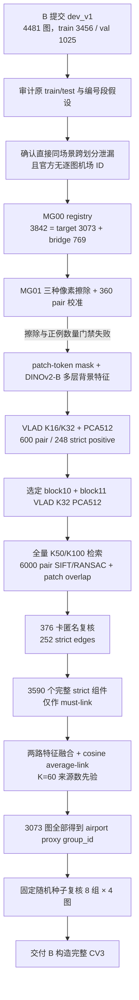

# MAR20 机场代理分组：从 B 的 `dev_v1` 到 K=60 的完整链式记录与文件索引

## 0. 文档用途与当前唯一结论

本文是 MAR20 来源分组工作的单一入口，覆盖从收到 B 的 `dev_v1`、发现机场分组假设错误，到完成 60 个机场代理视觉域的全部有效实验、代码、任务单、结果和审计文件。以后整理项目时应先读本文，再按链接追溯具体环节，不需要移动现有文件。

当前正式状态：

```text
airport proxy groups: 60
competition MAR20 images: 3,073 / 3,073
strict local-scene component split: 0
status: airport_proxy_k60_ready_for_cv3
formal_grouping_admission: true
semantic boundary: visual airport proxy, not true airport identity
```

给 B 的唯一主文件：

- [`mar20_airport_proxy_assignments_target.csv`](../../outputs/MAR20-AIRPORT-PROXY-K60-v1/final/mar20_airport_proxy_assignments_target.csv)
- SHA256：`afde2a3d9b9941ad5fc603d979adcdf68a0c9819541eeb96a06993654529cf87`

最终验收与随机图像复核：

- [`MAR20_AIRPORT_PROXY_K60_ACCEPTANCE_v1.md`](MAR20_AIRPORT_PROXY_K60_ACCEPTANCE_v1.md)
- [`RANDOM_VISUAL_AUDIT_RESULT.md`](../../outputs/MAR20-AIRPORT-PROXY-K60-v1/visual-audit/RANDOM_VISUAL_AUDIT_RESULT.md)

旧 `dev_v1` 仍可作为 relaxed/同分布开发参考，但不能再承担正式跨机场泛化评估。旧的 2,882 个局部连通分量也不能直接作为 CV3 `group_id`；其中的 strict 关系只作为 K=60 聚类的不可拆约束。

---

## 1. 一张图理解完整链路



该链路有两个证据层级：

1. **strict local-scene**：证明相同画面、几何重叠或同一局部地点，作为硬 must-link；
2. **airport proxy K=60**：利用完整背景表征和公开的 60 个来源机场数量先验组织视觉域，不提供机场名称，也不宣称是真值。

---

## 2. 起点：B 提交了什么

### 2.1 Git 提交与文件

B 的相关提交为：

```text
a8d54f2 feat(data): 生成 dev_v1 划分与图像级 group_id
```

核心文件：

- [`data/splits/dev_v1.json`](../../data/splits/dev_v1.json)：4,481 张图的 train/val 和原 `group_id`；
- [`scripts/build_split.py`](../../scripts/build_split.py)：生成 `dev_v1`；
- [`scripts/analyze_groups.py`](../../scripts/analyze_groups.py)：文件名规则分组统计；
- [`scripts/check_aircraft_side_coverage.py`](../../scripts/check_aircraft_side_coverage.py)：MAR20 两侧覆盖检查；
- [`scripts/check_mar20_imagesets.py`](../../scripts/check_mar20_imagesets.py)：官方列表覆盖核查；
- [`scripts/check_mar20_order.py`](../../scripts/check_mar20_order.py)：编号顺序检查；
- [`scripts/check_mar20_blocks.py`](../../scripts/check_mar20_blocks.py)：连续编号/类别块检查；
- [`scripts/find_near_duplicates.py`](../../scripts/find_near_duplicates.py)：dHash 近重复候选；
- [`reports/data/near_duplicates_mar20.json`](near_duplicates_mar20.json)：7 个早期近重复组；
- [`third_party/mar20/train.txt`](../../third_party/mar20/train.txt) 与 [`test.txt`](../../third_party/mar20/test.txt)：B 提交的 MAR20 编号列表；
- [`third_party/mar20/README.md`](../../third_party/mar20/README.md)：当时对官方侧和编号段的解释。

`dev_v1` 的实际统计：

| 项目 | 数量 |
|---|---:|
| 全部图像 | 4,481 |
| train / val | 3,456 / 1,025 |
| MAR20 竞赛图 | 3,073 |
| MAR20 train / val | 2,366 / 707 |
| MAR20 原分组数 | 1,243 |
| `mar20_official_train_side` | 1,083 图，全部强制训练 |
| `mar20_testset_segment` | 1,990 图 |
| 25 类验证覆盖 | 有 |
| 原规则 `group_id` 跨 train/val | 0 |

`group_id` 不跨 split 只能证明求解器遵守了自己生成的分组，不能证明该分组等于机场来源。

### 2.2 原方法的关键错误

[`build_split.py`](../../scripts/build_split.py) 当时执行：

1. MAR20 官方 train 侧每张图独立成组并强制进入训练；
2. test.txt 遇到编号不递增时新建一段，最终形成 173 个编号段；
3. 用少量 dHash 近重复 pair 对整段做并查集合并；
4. 把这些段当作机场/场景代理。

但公开 MAR20 没有逐图机场 ID，train/test 只是编号列表；编号递增段既会把同机场切开，也可能把不同机场混合。单个 dHash 假阳性还可能把两个大段链式合并。因此“原始 train/test 机场互斥”和“test 内每个编号段等于一个机场”都没有足够元数据支持。

---

## 3. 错误证据与影响判断

### 3.1 原始数据和问题讨论入口

- 原始 MAR20 图像：[`MAR20/JPEGImages/`](../../../MAR20/JPEGImages/)
- 原始标注：[`MAR20/Annotations/`](../../../MAR20/Annotations/)
- 原始列表：[`MAR20/ImageSets/Main/train.txt`](../../../MAR20/ImageSets/Main/train.txt)、[`test.txt`](../../../MAR20/ImageSets/Main/test.txt)
- 与 GPT Pro 的完整问题讨论：[`doc/机场问题.md`](../../../doc/机场问题.md)
- 第一版完整问题定义：[`MAR20_AIRPORT_PROXY_GROUPING_PROTOCOL_v1.md`](MAR20_AIRPORT_PROXY_GROUPING_PROTOCOL_v1.md)
- 吸收外部意见后的执行协议：[`MAR20_SOURCE_GROUPING_EXECUTION_PLAN_v1.md`](MAR20_SOURCE_GROUPING_EXECUTION_PLAN_v1.md)

### 3.2 已确认的直接泄漏下限

通过背景候选、飞机遮挡后的局部特征、RANSAC 和人工复核，确认：

| 范围 | 结果 |
|---|---|
| MAR20 官方 train/test 两侧 | 极严格 12 对；扩大后约 25 对、约 48 张图 |
| `dev_v1` train/val 两侧 | 10 对极严格；17 对清晰、另 2 对高度可能 |
| 受影响验证飞机对象 | 约 70～144 / 4,154，约 1.69%～3.47% |
| 局部高风险类示例 | 一版保守统计中 A18/KC-10 为 8/31，约 25.8% |

这只是可以直接证明的相同/重叠画面泄漏下限，尚不包括同一机场中完全不重叠的跑道、机坪或不同年份视角。

### 3.3 对既有 P 系列结论的影响

- P03 约 0.97 的 GT crop 分类结果仍证明 ImageNet 表征经遥感域微调后具有很高上限；
- 它不能再解释成可靠的跨机场泛化成绩；
- P04 的 DINOv2-B 领先仍是有效候选结论，但正式教师排序应在新 CV3 上重跑；
- P04 缓存与 probe 代码可复用，换 fold 后成本较低；
- P06 正式 OOF 依赖可信 CV3，因此本任务成为后续实验的前置门禁。

---

## 4. 分组科学边界与最终工程决策

MAR20 论文和公开介绍称完整 3,842 张图来自全球 60 个军用机场，但项目中没有获得图像—机场映射。可以较可靠证明的是相同画面、局部重叠和同一停机区；对同一机场中完全不重叠的远距离视角，只能做概率代理。

最初协议因此强调不把某次聚类伪装成机场真值。最终为了给 B 提供能够实际运行 CV3 的完整 `group_id`，做出明确的工程收敛：

- 使用 60 作为公开来源数先验；
- 先锁住所有高置信 strict local-scene 组件；
- 再用两路已校准的背景 VLAD 描述子做确定性 K=60 average-link；
- 结果只命名为 `airport_proxy_visual_cluster`；
- 接受适度过合并带来的保守性，不宣称恢复机场名称或真实机场身份。

这个决定替代了无限扩展人工复核、LightGlue/RoMa、HDBSCAN 扫描和 embargo 循环，形成当前可维护的最终链路。

---

## 5. 阶段一：MG00 registry 和 target/bridge 映射

### 5.1 做了什么

完整 MAR20 包含 3,842 张图，其中：

- 3,073 张与竞赛飞机图一一对应，称 `target`；
- 769 张只用于来源结构和近邻桥接，称 `bridge`；
- bridge 从未进入比赛模型训练。

逐图核验文件字节、EXIF 校正后 RGB 像素、尺寸、原 XML HBB 和竞赛 YOLO 细类直方图。

### 5.2 结果

| 项目 | 结果 |
|---|---:|
| registry | 3,842 |
| target / bridge | 3,073 / 769 |
| official train/test | 1,331 / 2,511 |
| target 文件字节不一致 | 0 |
| target RGB 像素不一致 | 0 |
| target 类直方图不一致 | 0 |
| H0 完整像素重复 | 0 |
| 原 XML 尺寸缺失 | 21，使用真实解码尺寸并记录 |

关键产物：

- [`image_registry.csv`](../../outputs/MAR20-GROUPING-TASK-00-phase-a-return/MAR20-GROUPING-TASK-00/registry/image_registry.csv)，SHA `bcdc4b697532be0899b84abb7f218a0fc2fec2c08e5aaeb3460336eea7b7201d`；
- [`image_annotations.jsonl`](../../outputs/MAR20-GROUPING-TASK-00-phase-a-return/MAR20-GROUPING-TASK-00/registry/image_annotations.jsonl)，SHA `0a350c1d68e63dd134ca5f4b6a1f89c16f9a4d457f34598b72f2c1eface650f4`；
- [`registry_summary.json`](../../outputs/MAR20-GROUPING-TASK-00-phase-a-return/MAR20-GROUPING-TASK-00/registry/registry_summary.json)；
- 阶段回传目录：[`MAR20-GROUPING-TASK-00-phase-a-return/`](../../outputs/MAR20-GROUPING-TASK-00-phase-a-return/)。

实现说明：[`MAR20_SOURCE_GROUPING_BATCH_A_IMPLEMENTATION_REPORT_v1.md`](MAR20_SOURCE_GROUPING_BATCH_A_IMPLEMENTATION_REPORT_v1.md)。

---

## 6. 阶段二：目标擦除方法和第一轮 pair 校准

### 6.1 初始实验

在 120 个节点上比较：

- blur；
- local mean；
- Telea inpaint；
- 不接触飞机框的 background tile。

同时构造 360 个唯一 pair 和 29 个盲重复，用于校准 `same_frame / geometric_overlap / same_local_site / likely_same_airport / negative`。

### 6.2 结果与改线原因

| 方法 | 飞机残留率 | 修补伪影率 | 结论 |
|---|---:|---:|---|
| blur | 89.17% | 75.83% | 不通过 |
| local mean | 5.83% | 80.83% | 不通过 |
| Telea | 13.33% | 75.83% | 不通过 |

background tile 114 个可用节点中仍有 1 个含疑似飞机，未达到预注册的零残留要求。360 个 pair 只有 19 个 strict positive，虽经复核后盲重复一致率为 1.0，但不足以冻结阈值。

因此没有放宽门槛，也没有把视觉上最自然的 Telea 强行用于全量描述子；后续改为**不修改像素，只在 DINO patch token 聚合阶段屏蔽飞机区域**。

结果入口：

- [`MAR20_GROUPING_TASK_00A_AI_VISUAL_REVIEW_RESULT_v1.md`](MAR20_GROUPING_TASK_00A_AI_VISUAL_REVIEW_RESULT_v1.md)；
- [`MAR20_SOURCE_GROUPING_TASK_00A_ACCEPTANCE_v1.md`](MAR20_SOURCE_GROUPING_TASK_00A_ACCEPTANCE_v1.md)；
- [`MAR20_SOURCE_GROUPING_ROUND_A_ACCEPTANCE_AND_TASK_00B_PLAN_v1.md`](MAR20_SOURCE_GROUPING_ROUND_A_ACCEPTANCE_AND_TASK_00B_PLAN_v1.md)，记录 Round-A 无准入结论和改用 patch-token mask 的下一步；
- 安全人工包：[`MAR20-GROUPING-TASK-00A-blind-review-safe/`](../../outputs/MAR20-GROUPING-TASK-00A-blind-review-safe/)；
- 服务器结果：[`MAR20-00A-return-extracted/`](../../outputs/MAR20-00A-return-extracted/)。

---

## 7. 阶段三：patch-token mask、VLAD 和正例扩充

### 7.1 正式背景特征

固定：

- DINOv2-B/14；
- 输入 518×518，patch14，37×37 token；
- 飞机 HBB 分别外扩 10%、15%、20% 做审计，主设置 15%；
- patch 与飞机掩码面积交比超过 20% 时，不进入背景聚合；
- zero-based block 9/10/11；
- masked mean、signed GeM 和 VLAD；
- VLAD K=16/32，local PCA128，global PCA-whiten-512；
- 0/90/180/270 四旋转；
- 769 bridge 只参与结构，不进入训练。

### 7.2 low-valid 门禁

全量提取完成 15,368 行，即 3,842×4。19 张图的有效背景 patch 比例低于原 25% 门槛，其中 4 张低于 10%；最少仍有 71 个有效 token。

审查后没有重提特征或缩小 mask，而是：

- 保留原掩码和质量标记；
- 低支持图禁止仅凭单一路径自动成边；
- 要求几何、哈希、其他证据或人工确认；
- 继续进行 VLAD 与 pair 富集。

相关说明：

- [`MAR20_00B1_LOW_VALID_PATCH_REVIEW_AND_CONTINUATION_PLAN_v1.md`](MAR20_00B1_LOW_VALID_PATCH_REVIEW_AND_CONTINUATION_PLAN_v1.md)；
- [`low_valid_patch_fraction_review.json`](../../outputs/MAR20-00B1-return-safe/mar20-00b1-return/low-valid-review/low_valid_patch_fraction_review.json)。

### 7.3 人工门禁与校准集扩充

第二轮审核：

- patch-mask：120/120 有效；
- 10%/15%/20% 的飞机覆盖率均为 1.0；
- 15% 主设置过度背景损失为 0；
- 富集候选 240 个唯一 pair + 24 个盲重复；
- 重复标签一致率 1.0；
- 与 Round-A 合并为 600 个 pair；
- strict positive 248 个，其中 calibration 186、held-out 62；
- 新增 strict positive 229 个。

结果入口：

- [`MAR20_SOURCE_GROUPING_TASK_00B_IMPLEMENTATION_REPORT_v1.md`](MAR20_SOURCE_GROUPING_TASK_00B_IMPLEMENTATION_REPORT_v1.md)；
- [`MAR20_SOURCE_GROUPING_TASK_00B1_MANUAL_REVIEW_RESULT_v1.md`](MAR20_SOURCE_GROUPING_TASK_00B1_MANUAL_REVIEW_RESULT_v1.md)；
- [`calibration_pairs_v1p2.csv`](../../outputs/mar20-00b2-return/calibration-v1p2/calibration_pairs_v1p2.csv)；
- [`patch-mask-decision.json`](../../outputs/mar20-00b2-return/patch-mask-decision.json)；
- 00B1 结果与缓存元数据：[`MAR20-00B1-return-safe/`](../../outputs/MAR20-00B1-return-safe/)；
- 人工冻结输入：[`MAR20-00B2-manual-input/`](../../outputs/MAR20-00B2-manual-input/)。

---

## 8. 阶段四：Round-B 描述子选择

在 9 条路由、13 个候选组合中，只用 calibration 选择路由，held-out 只验收，避免用 held-out 反向调参。

最终固定：

```text
masked_block10_vlad_k32_pca512
masked_block11_vlad_k32_pca512
```

主要结果：

- calibration positive R@20/50/100：0.9839 / 0.9892 / 0.9892；
- held-out positive R@20/50/100：0.9839 / 1.0000 / 1.0000；
- 所有 exact pair 的 R@20/50/100 均为 1.0；
- `selection_uses_heldout=false`。

入口：

- [`round_b_decision.json`](../../outputs/mar20-00b2-return/round-b/round_b_decision.json)；
- [`round_b_descriptor_bakeoff.csv`](../../outputs/mar20-00b2-return/round-b/round_b_descriptor_bakeoff.csv)；
- [`MAR20_SOURCE_GROUPING_TASK_00B2_ACCEPTANCE_AND_TASK01_PLAN_v1.md`](MAR20_SOURCE_GROUPING_TASK_00B2_ACCEPTANCE_AND_TASK01_PLAN_v1.md)；
- 冻结路由配置：[`mar20_00b_round_b_routes_server.json`](../../configs/grouping/mar20_00b_round_b_routes_server.json)。

---

## 9. 阶段五：全量检索、局部几何和匿名 pair 审核

### 9.1 全量检索

两路描述子在完整 3,842 图上执行每路 K=50，K=100 仅审计：

| 项目 | 结果 |
|---|---:|
| K=50 full-bridge edge | 173,028 |
| K=50 target edge | 110,604 |
| K=100 audit edge | 343,248 |
| all positive R@50 / R@100 | 0.9899 / 0.9919 |
| held-out R@50 / R@100 | 1.0 / 1.0 |

正式摘要：[`retrieval_summary.json`](../../outputs/MAR20-T01-return-extracted/mar20-t01-return/retrieval_summary.json)。

### 9.2 6,000 pair 几何证据

冻结队列包括：

- 600 个 calibration/held-out 控制 pair；
- 5,400 个新候选；
- target-target 3,955；
- target-bridge 1,796；
- bridge-bridge 249；
- patch overlap 覆盖 3,824/3,842 节点；
- 背景 SIFT + similarity/affine/homography RANSAC 全部计算。

29 对退化 affine fit 产生 87 个非有限字段。修订策略不是写 0 或丢弃整对，而是把该 affine 模型标记为缺失证据，保留其他 DINO、patch、SIFT 和变换证据。清洗后 6,000 行非有限值为 0。

入口：

- [`geometry_queue.csv`](../../outputs/MAR20-T01-return-extracted/mar20-t01-return/geometry-queue/geometry_queue.csv)；
- [`pair_evidence_sanitized.csv`](../../outputs/MAR20-01A-return-extracted/geometry-sanitized/pair_evidence_sanitized.csv)；
- [`geometry_sanitization_summary.json`](../../outputs/MAR20-01A-return-extracted/geometry-sanitized/geometry_sanitization_summary.json)；
- [`MAR20_SOURCE_GROUPING_TASK01_IMPLEMENTATION_REPORT_v1.md`](MAR20_SOURCE_GROUPING_TASK01_IMPLEMENTATION_REPORT_v1.md)；
- [`MAR20_SOURCE_GROUPING_TASK01_REVIEW_AND_01A_PLAN_v1.md`](MAR20_SOURCE_GROUPING_TASK01_REVIEW_AND_01A_PLAN_v1.md)。

### 9.3 最终匿名复核和 strict 组件

审核包包含 300 个新 pair、48 个隐藏控制、28 个盲重复，共 376 张卡、348 个唯一 pair。

结果：

| 项目 | 结果 |
|---|---:|
| 解盲前决策 SHA | `1b92730e68ca48cd7a0616cc446101d22a4e4eebb733543ef78653720380fde2` |
| 复核后决策 SHA | `ed30b2dcf0e7aa563abc67fc32dd9a6225431095e70f9f6884e2f0075342ab93` |
| 重复 role 一致 | 28/28 |
| 正控制 strict | 25/26 |
| 负控制 strict | 0/24 |
| strict edges | 252 |
| strict negative conflict | 0 |
| 完整 strict components | 3,590 |

strict 只接受 `same_frame / geometric_overlap / same_local_site` 且置信度不低于 0.85。`likely_same_airport` 不作为局部真值。

入口：

- [`manual_review_decisions_ai_resolved.csv`](../../outputs/MAR20-01A-return-extracted/blind-review/manual_review_decisions_ai_resolved.csv)；
- [`blind_mapping_private.csv`](../../outputs/MAR20-01A-return-extracted/blind-review/blind_mapping_private.csv)，仅用于解盲审计；
- [`strict_core_edges.csv`](../../outputs/MAR20-FINAL-GROUPING-v1/strict_core_edges.csv)；
- [`mar20_group_assignments_all.csv`](../../outputs/MAR20-FINAL-GROUPING-v1/mar20_group_assignments_all.csv)，作为 K=60 的 must-link 输入，SHA `e095e52130e3849c2ee4b43be8a90b2d61a73cc2482da5e88c175021a32305e9`；
- [`MAR20_SOURCE_GROUPING_TASK01A_BLIND_REVIEW_AND_TARGET_CORE_v1.md`](MAR20_SOURCE_GROUPING_TASK01A_BLIND_REVIEW_AND_TARGET_CORE_v1.md)。

这里的 strict component 是中间证据，不是交付给 B 的机场 `group_id`。

---

## 10. 阶段六：K=60 机场代理视觉域

### 10.1 算法

1. 对 block10 和 block11 的四旋转 PCA512 VLAD 分别取均值并 L2 归一化；
2. 两路等权拼接，再 L2 归一化；
3. 将 3,590 个 strict local-scene 组件折叠为不可拆原子；
4. 使用 cosine average-link 层次聚类；
5. 以 MAR20 公布的 60 个来源机场作为 K=60 结构先验；
6. 按每簇最小 MAR20 编号稳定命名；
7. 展开回 3,842 图，保证 strict component split 为 0；
8. 从中导出 3,073 张比赛图的唯一映射。

实现与任务单：

- [`src/rsdet/grouping/airport_proxy.py`](../../src/rsdet/grouping/airport_proxy.py)；
- [`scripts/compile_mar20_airport_proxy.py`](../../scripts/compile_mar20_airport_proxy.py)；
- [`tests/test_mar20_airport_proxy.py`](../../tests/test_mar20_airport_proxy.py)；
- [`MAR20_GROUPING_TASK_02_AIRPORT_PROXY_K60.md`](../../docs/server/MAR20_GROUPING_TASK_02_AIRPORT_PROXY_K60.md)；
- [`MAR20_GROUPING_TASK_02_CODE_SHA256.txt`](../../docs/server/MAR20_GROUPING_TASK_02_CODE_SHA256.txt)；
- [`MAR20_AIRPORT_PROXY_K60_CORRECTION_AND_EXECUTION_v1.md`](MAR20_AIRPORT_PROXY_K60_CORRECTION_AND_EXECUTION_v1.md)。

### 10.2 最终统计

| 项目 | 结果 |
|---|---:|
| 完整/含 target 的代理组 | 60 / 60 |
| target 覆盖 | 3,073 / 3,073 |
| 完整组大小 min/median/max | 9 / 59.5 / 148 |
| target 组大小 min/median/max | 6 / 48 / 114 |
| strict component split | 0 |
| block10 vs block11 ARI | 0.7014 |
| block10 vs fused ARI | 0.7544 |
| block11 vs fused ARI | 0.8106 |
| membership cosine p05 / median | 0.1764 / 0.3531 |
| centroid margin p05 / median | 0.0249 / 0.2427 |
| 服务器确定性复跑 | CSV 完全一致 |

最终产物：

- [`mar20_airport_proxy_assignments_all.csv`](../../outputs/MAR20-AIRPORT-PROXY-K60-v1/final/mar20_airport_proxy_assignments_all.csv)，SHA `daa08d75b81fb7ac11b4e5ae49add66357dbf327ddd90fcb6fbab7cafbedfc1b`；
- [`mar20_airport_proxy_assignments_target.csv`](../../outputs/MAR20-AIRPORT-PROXY-K60-v1/final/mar20_airport_proxy_assignments_target.csv)，SHA `afde2a3d9b9941ad5fc603d979adcdf68a0c9819541eeb96a06993654529cf87`；
- [`airport_proxy_summary.json`](../../outputs/MAR20-AIRPORT-PROXY-K60-v1/final/airport_proxy_summary.json)，SHA `0d063ad01ba6610c3cdb899738dbb577b3ec87f1e4fe2122e5bab13eff401d6f`；
- [`task_decision.json`](../../outputs/MAR20-AIRPORT-PROXY-K60-v1/final/task_decision.json)；
- [`MAR20-AIRPORT-PROXY-K60-v1-return.tar.gz`](../../outputs/MAR20-AIRPORT-PROXY-K60-v1-return.tar.gz)，SHA `0e0b720e00874b532f912495e542fb28592a9bd8333781f122c63de730082f4e`。

---

## 11. 最终随机图像复核

抽样合同：固定种子 `20260722`，从 60 组无放回抽取 8 组，每组随机取 4 张 target 图，共 32 张。

抽中组：036、050、026、005、058、037、004、016。

结果：

- 4/8 组视觉一致性较强；
- 2/8 组中等一致；
- 2/8 组存在明显异质性，可能属于保守过合并；
- 代理域作为 GroupCV 原子仍可使用；
- 结果不支持“已经恢复真实机场标签”的说法。

文件：

- [`random_sample_manifest.csv`](../../outputs/MAR20-AIRPORT-PROXY-K60-v1/visual-audit/random_sample_manifest.csv)，SHA `c5c1c674f20550dc8ff5fb6c756d5c5cf4ec2869fa9d41ae5fa9938dbe2dd218`；
- [`random-groups-sheet-01.jpg`](../../outputs/MAR20-AIRPORT-PROXY-K60-v1/visual-audit/random-groups-sheet-01.jpg)；
- [`random-groups-sheet-02.jpg`](../../outputs/MAR20-AIRPORT-PROXY-K60-v1/visual-audit/random-groups-sheet-02.jpg)；
- [`RANDOM_VISUAL_AUDIT_RESULT.md`](../../outputs/MAR20-AIRPORT-PROXY-K60-v1/visual-audit/RANDOM_VISUAL_AUDIT_RESULT.md)。

异质组更可能造成不同真实机场被保守合并，代价是训练自由度和独立组数减少，而不是同一代理组跨 fold 泄漏。仍无法从公开数据定量排除“同一真实机场被拆成多个代理组”的风险。

---

## 12. 给 B 的正式使用合同

B 只需读取：

```text
competition_image_id,group_id
```

要求：

1. 3,073 张 MAR20 图全部按新 `group_id` 作为不可拆分原子；
2. 与舰船、车辆和非 MAR20 图已有来源组一起进入统一三折求解器；
3. 同一 `group_id` 绝不跨 fold；
4. 每张比赛训练图恰好成为一次验证样本；
5. 先保证结构可行的 25 类覆盖，再平衡各类对象数、总对象数和图像数；
6. `membership_cosine` 和 `centroid_margin` 只用于审计，不据此把低置信成员拆成 singleton；
7. MAR20 official train/test 只保留审计字段，不能作为机场真值；
8. 对外命名为“MAR20 机场代理来源隔离 CV3”或 `airport-proxy grouped CV3`。

完成完整 CV3 后，应回传：

- 每折图像数、对象数和 25 类对象分布；
- 每折 MAR20 代理组数；
- 同组跨 fold 数，必须为 0；
- 每张图 OOF 次数，必须恰为 1；
- 最大组及各折组规模；
- split 文件 SHA 和求解器版本。

---

## 13. 代码总索引

### 13.1 核心包

| 文件 | 作用 |
|---|---|
| [`__init__.py`](../../src/rsdet/grouping/__init__.py) | 分组包的公开合同入口 |
| [`contracts.py`](../../src/rsdet/grouping/contracts.py) | node/pair UID、标签、SHA、原子 JSON 和协议常量 |
| [`registry.py`](../../src/rsdet/grouping/registry.py) | 原始/竞赛映射、像素与标注核验 |
| [`masks.py`](../../src/rsdet/grouping/masks.py) | HBB 外扩、patch 有效性、旋转视图 |
| [`descriptors.py`](../../src/rsdet/grouping/descriptors.py) | DINOv2-B 多层背景描述子 |
| [`cache.py`](../../src/rsdet/grouping/cache.py) | 分片缓存、指纹、resume、完整性审计 |
| [`vlad.py`](../../src/rsdet/grouping/vlad.py) | local PCA、视觉词典和 VLAD 聚合 |
| [`retrieval.py`](../../src/rsdet/grouping/retrieval.py) | 多旋转 KNN 和多路召回 |
| [`geometry.py`](../../src/rsdet/grouping/geometry.py) | patch overlap、SIFT 和 RANSAC 证据 |
| [`view_review.py`](../../src/rsdet/grouping/view_review.py) | 背景视图人工复核合同 |
| [`airport_proxy.py`](../../src/rsdet/grouping/airport_proxy.py) | strict 折叠、两路融合、K=60 层次聚类和置信度 |

### 13.2 执行脚本

| 阶段 | 文件 |
|---|---|
| 环境门禁 | [`check_mar20_grouping_environment.py`](../../scripts/check_mar20_grouping_environment.py) |
| registry | [`build_mar20_source_registry.py`](../../scripts/build_mar20_source_registry.py) |
| 视图模板/审核 | [`build_mar20_view_review_template.py`](../../scripts/build_mar20_view_review_template.py)、[`audit_mar20_background_views.py`](../../scripts/audit_mar20_background_views.py)、[`compile_mar20_view_review.py`](../../scripts/compile_mar20_view_review.py) |
| 第一轮特征/校准 | [`extract_mar20_place_features.py`](../../scripts/extract_mar20_place_features.py)、[`build_mar20_calibration_review.py`](../../scripts/build_mar20_calibration_review.py)、[`compile_mar20_calibration_review.py`](../../scripts/compile_mar20_calibration_review.py)、[`analyze_mar20_descriptor_bakeoff.py`](../../scripts/analyze_mar20_descriptor_bakeoff.py) |
| patch-mask | [`audit_mar20_patch_masks.py`](../../scripts/audit_mar20_patch_masks.py)、[`extract_mar20_masked_patch_features.py`](../../scripts/extract_mar20_masked_patch_features.py)、[`review_mar20_low_valid_patch_fraction.py`](../../scripts/review_mar20_low_valid_patch_fraction.py) |
| VLAD | [`fit_mar20_vlad_codebooks.py`](../../scripts/fit_mar20_vlad_codebooks.py)、[`extract_mar20_vlad_features.py`](../../scripts/extract_mar20_vlad_features.py)、[`project_mar20_vlad_cache.py`](../../scripts/project_mar20_vlad_cache.py) |
| pair 富集 | [`mine_mar20_enriched_candidates.py`](../../scripts/mine_mar20_enriched_candidates.py)、[`build_mar20_enriched_calibration_review.py`](../../scripts/build_mar20_enriched_calibration_review.py)、[`compile_mar20_enriched_calibration.py`](../../scripts/compile_mar20_enriched_calibration.py)、[`compile_mar20_patch_mask_review.py`](../../scripts/compile_mar20_patch_mask_review.py) |
| 路由选择 | [`analyze_mar20_round_b.py`](../../scripts/analyze_mar20_round_b.py)、[`compile_mar20_00b_decision.py`](../../scripts/compile_mar20_00b_decision.py)、[`compile_mar20_00b1_phase_a_decision.py`](../../scripts/compile_mar20_00b1_phase_a_decision.py) |
| 正式检索 | [`retrieve_mar20_task01_candidates.py`](../../scripts/retrieve_mar20_task01_candidates.py)、[`build_mar20_geometry_queue.py`](../../scripts/build_mar20_geometry_queue.py) |
| 局部几何 | [`extract_mar20_patch_overlap_cache.py`](../../scripts/extract_mar20_patch_overlap_cache.py)、[`verify_mar20_task01_geometry.py`](../../scripts/verify_mar20_task01_geometry.py)、[`sanitize_mar20_task01_geometry.py`](../../scripts/sanitize_mar20_task01_geometry.py)、[`analyze_mar20_task01_geometry.py`](../../scripts/analyze_mar20_task01_geometry.py) |
| 盲审/core | [`build_mar20_task01_blind_review.py`](../../scripts/build_mar20_task01_blind_review.py)、[`compile_mar20_task01_ai_review.py`](../../scripts/compile_mar20_task01_ai_review.py)、[`compile_mar20_target_core.py`](../../scripts/compile_mar20_target_core.py) |
| AI 复核材料 | [`build_ai_manual_review_artifacts.mjs`](../../scripts/mar20/build_ai_manual_review_artifacts.mjs) |
| K=60 | [`compile_mar20_airport_proxy.py`](../../scripts/compile_mar20_airport_proxy.py) |

### 13.3 配置和依赖

- [`requirements-mar20-grouping.txt`](../../requirements-mar20-grouping.txt)
- [`mar20_source_grouping_v1.yaml`](../../configs/grouping/mar20_source_grouping_v1.yaml)
- [`mar20_00b_candidate_routes_server.json`](../../configs/grouping/mar20_00b_candidate_routes_server.json)
- [`mar20_00b_round_b_routes_server.json`](../../configs/grouping/mar20_00b_round_b_routes_server.json)
- [`mar20_task01_retrieval_geometry_v1.json`](../../configs/grouping/mar20_task01_retrieval_geometry_v1.json)

### 13.4 测试

- [`test_mar20_grouping_batch_a.py`](../../tests/test_mar20_grouping_batch_a.py)
- [`test_mar20_grouping_00b.py`](../../tests/test_mar20_grouping_00b.py)
- [`test_mar20_grouping_00b1.py`](../../tests/test_mar20_grouping_00b1.py)
- [`test_mar20_grouping_task01.py`](../../tests/test_mar20_grouping_task01.py)
- [`test_mar20_airport_proxy.py`](../../tests/test_mar20_airport_proxy.py)

---

## 14. 服务器任务单链

按顺序执行并复用同一服务器缓存：

1. [`MAR20_GROUPING_TASK_00_REGISTRY_AND_BAKEOFF.md`](../../docs/server/MAR20_GROUPING_TASK_00_REGISTRY_AND_BAKEOFF.md) + [`CODE_SHA256`](../../docs/server/MAR20_GROUPING_TASK_00_CODE_SHA256.txt)
2. [`MAR20_GROUPING_TASK_00A_METHOD_REVIEW_AND_CALIBRATION.md`](../../docs/server/MAR20_GROUPING_TASK_00A_METHOD_REVIEW_AND_CALIBRATION.md) + [`CODE_SHA256`](../../docs/server/MAR20_GROUPING_TASK_00A_CODE_SHA256.txt)
3. [`MAR20_GROUPING_TASK_00B_MASKED_PATCH_VLAD_AND_ENRICHMENT.md`](../../docs/server/MAR20_GROUPING_TASK_00B_MASKED_PATCH_VLAD_AND_ENRICHMENT.md) + [`CODE_SHA256`](../../docs/server/MAR20_GROUPING_TASK_00B_CODE_SHA256.txt)
4. [`MAR20_GROUPING_TASK_00B1_LOW_VALID_REVIEW_AND_CONTINUE.md`](../../docs/server/MAR20_GROUPING_TASK_00B1_LOW_VALID_REVIEW_AND_CONTINUE.md) + [`CODE_SHA256`](../../docs/server/MAR20_GROUPING_TASK_00B1_CODE_SHA256.txt)
5. [`MAR20_GROUPING_TASK_00B2_MANUAL_COMPILE_AND_ROUND_B.md`](../../docs/server/MAR20_GROUPING_TASK_00B2_MANUAL_COMPILE_AND_ROUND_B.md)
6. [`MAR20_GROUPING_TASK_01_RETRIEVAL_AND_GEOMETRY.md`](../../docs/server/MAR20_GROUPING_TASK_01_RETRIEVAL_AND_GEOMETRY.md) + [`CODE_SHA256`](../../docs/server/MAR20_GROUPING_TASK_01_CODE_SHA256.txt)
7. [`MAR20_GROUPING_TASK_01A_SANITIZE_AND_RECOMPILE.md`](../../docs/server/MAR20_GROUPING_TASK_01A_SANITIZE_AND_RECOMPILE.md) + [`CODE_SHA256`](../../docs/server/MAR20_GROUPING_TASK_01A_CODE_SHA256.txt)
8. [`MAR20_GROUPING_TASK_02_AIRPORT_PROXY_K60.md`](../../docs/server/MAR20_GROUPING_TASK_02_AIRPORT_PROXY_K60.md) + [`CODE_SHA256`](../../docs/server/MAR20_GROUPING_TASK_02_CODE_SHA256.txt)

大型服务器缓存没有全部回传本地，但由 meta/index/SHA 和最终输入指纹追踪：

```text
/workspace/mar20-group-cache/dinov2b-masked-patch-full-v1p2/
/workspace/mar20-group-cache/dinov2b-vlad-codebooks-v1p2/
/workspace/mar20-group-cache/dinov2b-vlad-full-v1p2/
/workspace/mar20-group-cache/dinov2b-vlad-pca512-full-v1p2/
/workspace/mar20-group-cache/dinov2b-task01-patch-overlap-v1/
```

在正式 CV3 和关键 P03/P04 复跑完成前，不应主动删除服务器上的两路 VLAD-PCA cache、codebook、strict/core 输入或 K=60 结果。

---

## 15. 本地结果目录与回传包索引

下表只列当前证据链仍需要保留的目录和归档，不列失败后已被后续方案替代的临时 smoke/partial 目录。

| 阶段 | 可读目录 | 原始回传/输入包 |
|---|---|---|
| MG00 registry | [`MAR20-GROUPING-TASK-00-phase-a-return/`](../../outputs/MAR20-GROUPING-TASK-00-phase-a-return/) | [`MAR20-GROUPING-TASK-00-phase-a.tar.gz`](../../outputs/MAR20-GROUPING-TASK-00-phase-a.tar.gz) |
| 00A 方法审核 | [`MAR20-00A-return-extracted/`](../../outputs/MAR20-00A-return-extracted/) | [`MAR20-00A-return.tar.gz`](../../outputs/MAR20-00A-return.tar.gz) |
| 00A 安全盲评 | [`MAR20-GROUPING-TASK-00A-blind-review-safe/`](../../outputs/MAR20-GROUPING-TASK-00A-blind-review-safe/) | [`MAR20-GROUPING-TASK-00A-blind-review-safe.tar.gz`](../../outputs/MAR20-GROUPING-TASK-00A-blind-review-safe.tar.gz) |
| 00B1 VLAD/富集 | [`MAR20-00B1-return-safe/`](../../outputs/MAR20-00B1-return-safe/) | [`MAR20-00B1-return.tar.gz`](../../outputs/MAR20-00B1-return.tar.gz) |
| 00B2 人工输入 | [`MAR20-00B2-manual-input/`](../../outputs/MAR20-00B2-manual-input/) | [`MAR20-00B2-manual-input.tar.gz`](../../outputs/MAR20-00B2-manual-input.tar.gz) |
| 00B2 编译/选路由 | [`mar20-00b2-return/`](../../outputs/mar20-00b2-return/) | [`MAR20-00B2-return.tar.gz`](../../outputs/MAR20-00B2-return.tar.gz) |
| TASK-01 检索/几何 | [`MAR20-T01-return-extracted/`](../../outputs/MAR20-T01-return-extracted/) | [`MAR20-T01-return.tar.gz`](../../outputs/MAR20-T01-return.tar.gz) |
| TASK-01A 修订/盲审 | [`MAR20-01A-return-extracted/`](../../outputs/MAR20-01A-return-extracted/) | [`MAR20-01A-return.tar.gz`](../../outputs/MAR20-01A-return.tar.gz) |
| strict local-scene 输入 | [`MAR20-FINAL-GROUPING-v1/`](../../outputs/MAR20-FINAL-GROUPING-v1/) | 目录内只有 `mar20_group_assignments_all.csv` 和 strict edge 等中间证据继续有效；带 `final` 名称的旧 target CSV 禁用 |
| K=60 最终结果 | [`MAR20-AIRPORT-PROXY-K60-v1/`](../../outputs/MAR20-AIRPORT-PROXY-K60-v1/) | [`MAR20-AIRPORT-PROXY-K60-v1-return.tar.gz`](../../outputs/MAR20-AIRPORT-PROXY-K60-v1-return.tar.gz) |

---

## 16. 报告阅读顺序

需要理解全过程时，按以下顺序：

1. 本文；
2. [`MAR20_AIRPORT_PROXY_GROUPING_PROTOCOL_v1.md`](MAR20_AIRPORT_PROXY_GROUPING_PROTOCOL_v1.md)：问题、证据和最初科学边界；
3. [`MAR20_SOURCE_GROUPING_EXECUTION_PLAN_v1.md`](MAR20_SOURCE_GROUPING_EXECUTION_PLAN_v1.md)：吸收 GPT Pro 意见后的执行协议；
4. [`MAR20_SOURCE_GROUPING_BATCH_A_IMPLEMENTATION_REPORT_v1.md`](MAR20_SOURCE_GROUPING_BATCH_A_IMPLEMENTATION_REPORT_v1.md)：MG00/MG01 初始实现；
5. [`MAR20_GROUPING_TASK_00A_AI_VISUAL_REVIEW_RESULT_v1.md`](MAR20_GROUPING_TASK_00A_AI_VISUAL_REVIEW_RESULT_v1.md)：像素擦除失败证据；
6. [`MAR20_SOURCE_GROUPING_TASK_00B_IMPLEMENTATION_REPORT_v1.md`](MAR20_SOURCE_GROUPING_TASK_00B_IMPLEMENTATION_REPORT_v1.md)：patch-mask/VLAD 实现；
7. [`MAR20_SOURCE_GROUPING_TASK_00B1_MANUAL_REVIEW_RESULT_v1.md`](MAR20_SOURCE_GROUPING_TASK_00B1_MANUAL_REVIEW_RESULT_v1.md)：600 pair 和 patch-mask 人工门禁；
8. [`MAR20_SOURCE_GROUPING_TASK_00B2_ACCEPTANCE_AND_TASK01_PLAN_v1.md`](MAR20_SOURCE_GROUPING_TASK_00B2_ACCEPTANCE_AND_TASK01_PLAN_v1.md)：两路 VLAD 入选；
9. [`MAR20_SOURCE_GROUPING_TASK01_REVIEW_AND_01A_PLAN_v1.md`](MAR20_SOURCE_GROUPING_TASK01_REVIEW_AND_01A_PLAN_v1.md)：6,000 pair 和非有限字段修订；
10. [`MAR20_SOURCE_GROUPING_TASK01A_BLIND_REVIEW_AND_TARGET_CORE_v1.md`](MAR20_SOURCE_GROUPING_TASK01A_BLIND_REVIEW_AND_TARGET_CORE_v1.md)：strict core 中间证据；
11. [`MAR20_AIRPORT_PROXY_K60_CORRECTION_AND_EXECUTION_v1.md`](MAR20_AIRPORT_PROXY_K60_CORRECTION_AND_EXECUTION_v1.md)：从 local scene 到 K=60 的层级更正；
12. [`MAR20_AIRPORT_PROXY_K60_ACCEPTANCE_v1.md`](MAR20_AIRPORT_PROXY_K60_ACCEPTANCE_v1.md)：最终验收；
13. [`RANDOM_VISUAL_AUDIT_RESULT.md`](../../outputs/MAR20-AIRPORT-PROXY-K60-v1/visual-audit/RANDOM_VISUAL_AUDIT_RESULT.md)：最终随机图像核查；
14. [`MAR20_DEV_V2_AIRPORT_PROXY_K60_SPLIT_ACCEPTANCE_v1.md`](MAR20_DEV_V2_AIRPORT_PROXY_K60_SPLIT_ACCEPTANCE_v1.md)：基于 K=60 的新开发划分及给 B 的两列映射。

---

## 17. 关键 SHA 链

| 产物 | SHA256 |
|---|---|
| B `dev_v1.json` | `bcb6fdb909df3421db800ea248022a39dd7e596c815192b97c388f836cd32aed` |
| registry CSV | `bcdc4b697532be0899b84abb7f218a0fc2fec2c08e5aaeb3460336eea7b7201d` |
| annotations JSONL | `0a350c1d68e63dd134ca5f4b6a1f89c16f9a4d457f34598b72f2c1eface650f4` |
| 600 pair calibration | `9d9e2a4686f7cd498c7e37a38cbae8812ab7820418e6e2dcfc7dc7250b3faa60` |
| Round-B decision | `d46205a27cf55d74c2cdcf56b9d0c4c98cb584b6261c3289731fc24687c1444f` |
| route config | `dfd88a6b25c028990f1eb90fe944902e29369ba4b5445ba2d41fc2250df8d837` |
| sanitized 6,000-pair evidence | `eac8686c8ad1c04dcdcda82794af377d40c0860a0211d0305cf9d385e72ce1be` |
| final blind decisions | `ed30b2dcf0e7aa563abc67fc32dd9a6225431095e70f9f6884e2f0075342ab93` |
| strict local-scene all assignments | `e095e52130e3849c2ee4b43be8a90b2d61a73cc2482da5e88c175021a32305e9` |
| K=60 all assignments | `daa08d75b81fb7ac11b4e5ae49add66357dbf327ddd90fcb6fbab7cafbedfc1b` |
| K=60 target assignments | `afde2a3d9b9941ad5fc603d979adcdf68a0c9819541eeb96a06993654529cf87` |
| K=60 summary | `0d063ad01ba6610c3cdb899738dbb577b3ec87f1e4fe2122e5bab13eff401d6f` |
| K=60 return archive | `0e0b720e00874b532f912495e542fb28592a9bd8333781f122c63de730082f4e` |
| random visual sample manifest | `c5c1c674f20550dc8ff5fb6c756d5c5cf4ec2869fa9d41ae5fa9938dbe2dd218` |

---

## 18. 当前完成边界和下一步

本阶段已经完成：

- B 原划分错误定位；
- 原始/竞赛 MAR20 一一映射；
- 目标遮挡方法审计；
- DINOv2-B mask-aware VLAD 描述子选择；
- 全量检索和局部几何；
- 两轮匿名视觉复核；
- strict local-scene must-link；
- 完整 60 组机场代理映射；
- 本地逐行、SHA、组规模和随机图像审计。

本阶段尚未完成、且属于 B/完整 CV3 后续的事项：

1. 将 60 个 MAR20 组与舰船、车辆和非 MAR20 来源组统一求解三折；
2. 冻结完整 4,481 图 CV3 及 SHA；
3. 在正式 CV3 上重跑 P03 关键工作点和 P04 关键教师；
4. 生成正式 OOF，解除 P06-TASK-02 的输入等待；
5. 后续增强、蒸馏和架构实验统一使用该 CV3。

只要最终材料始终使用“机场代理视觉域”这一准确名称，并保留随机审计中 2/8 异质组的边界说明，当前结果已经足以作为团队协作和后续正式评估的来源约束基础。

### 18.1 已生成新的开发划分

在本链完成后，已复用 B 的 `dev_v1` 生成 [`dev_v2_airport_proxy_k60.json`](../../data/splits/dev_v2_airport_proxy_k60.json)。舰船和车辆归属完全不变，MAR20 改用60个代理组重新分配，跨 train/val 分组为0。

- 给 B 的两列映射：[`mar20_airport_proxy_k60_for_b.csv`](../../data/groups/mar20_airport_proxy_k60_for_b.csv)；
- 划分验收报告：[`MAR20_DEV_V2_AIRPORT_PROXY_K60_SPLIT_ACCEPTANCE_v1.md`](MAR20_DEV_V2_AIRPORT_PROXY_K60_SPLIT_ACCEPTANCE_v1.md)；
- 机器审计：[`summary.json`](../../outputs/MAR20-DEV-V2-AIRPORT-PROXY-K60-v1/summary.json)。
