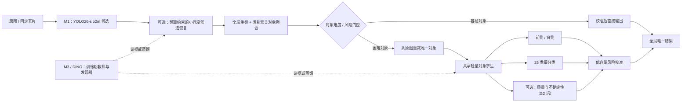

# 下一阶段团队创新执行总纲 v1

更新日期：2026-07-25  
适用起点：正确 YOLO26-s 正式三折 OOF 已完成，D/M3 与 E/10K 基线尚待收尾  
状态：`draft_pending_prelaunch_closure`  
预计启用：前置收尾完成后，由 A 宣布进入 Innovation Sprint

## 0. 文档用途与约束

本文件把以下内容收敛为一条可以由 A、B、C、D、E 共同执行的路线：

- GPT Pro 在 [`doc/0725.md`](../../../doc/0725.md) 中提出的任务重构和创新建议；
- 正式 M1 OOF 的真实错误结构；
- P0-1、P0-2、P03、P04、P05、P06、P07 已完成实验的正负证据；
- B 已冻结的正式 CV3 v2；
- C 已完成的 M1、D 尚未完成的 M3、E 尚未完成的 10K 工程；
- A 在下一阶段启动前必须补齐的协议、对象证据和正式复验工作。

它不是五份互相独立的个人任务单，也不是要求五个人各自“发明一个模块”。下一阶段只有一个共同目标：

> 以正式 OOF 错误为训练和决策依据，把当前瓦片级检测器升级为“候选形成—全局对象聚合—前景判断—细类识别—风险校准”的条件式系统；所有新模块都必须能被单独验证、单独删除和安全回退。

本总纲在正式启用前不覆盖当前 D、E 的既有合同。D、E 必须先完成旧交付，再进入创新任务；A、B、C 的前置工作可并行推进，不必空等。

---

## 1. 当前证据基线

### 1.1 已具备的可信基础

项目当前已经拥有：

1. 来源组隔离的正式三折 `cv3_airport_proxy_k60_v2`；
2. 4,481 张图、20,933 个 GT 的 D00 数据锁；
3. 正确 YOLO26-s 的三折低阈值 OOF；
4. 4,481 张图恰好一次 held-out 覆盖及 55,548 个候选；
5. 官方口径阈值曲线、逐折结果和计数守恒错误分解；
6. P03 普通对象分类、P04 教师特征、P05 背景、P06 框修正、P07 扩散增强的探索证据；
7. M3、10K 管线和二阶段对象路线的既有代码合同。

这意味着团队已经不应再进行泛泛的模型搜寻。下一阶段的每个实验必须对应一个已经量化的错误来源。

### 1.2 M1 正式 OOF 的关键结果

探索工作点 `score=0.051`：

| 项目 | 数值 | 含义 |
|---|---:|---|
| Overall Recall | 0.9172 | 总体召回已有可行区间 |
| Overall FDR | 0.1957 | 仅刚低于 0.20，安全余量不足 |
| TP / FP / FN | 19,199 / 4,671 / 1,734 | 可作为下一阶段唯一底座 |
| 候选下限 Recall | 0.9316 | 低阈值候选中仍有少量可恢复目标 |

逐大类结果：

| 大类 | Recall | FDR | 候选下限 Recall | 当前主要问题 |
|---|---:|---:|---:|---|
| 舰船 | 0.8512 | 0.3828 | 0.8993 | 保召回条件下的背景拒识 |
| 飞机 | 0.9338 | 0.1463 | 0.9394 | 细类混淆 |
| 车辆 | 0.6169 | 0.6161 | 0.7985 | 候选形成不足是首要待验证假设，同时存在高 FDR |

错误容量：

| 错误类型 | 数量 | 占比或解释 | 对应路线 |
|---|---:|---|---|
| `FP_BG` | 3,303 | 全部 FP 的 70.7% | B 的可信负样本 + A 的前景头 |
| `FN_CLS` | 1,115 | 全部 FN 的 64.3% | A 的对象细分类；DINO 条件式教师 |
| `FP_DUP` | 187 | 普通图 OOF 中不是最大项，10K 中仍须重测 | E 的全局对象唯一化 |
| `FN_LOC` | 66 | 仅占 FN 3.8% | P06/框扩散继续暂缓 |
| `FN_MISS` | 553 | 当前工作点下没有可匹配候选；需结合 candidate floor/near-miss 区分真缺失与低分候选 | C 的小目标恢复 + D 的异构发现 |

飞机 GT 占总 GT 的约 85.3%，因此总体成绩会掩盖舰船和车辆问题。下一阶段不得只报 Overall。

特别是车辆：工作点有 147 个 `FN_MISS`，但 candidate floor 下真正剩余的是
71 个 `FN_MISS` 和 10 个 `FN_LOC`。因此不能把 147 个都作为“小目标分支应找回
的真漏检”；必须先做 near-miss、`max_det` 饱和和内部层响应审计。

### 1.3 已有实验对下一阶段的约束

| 已完成工作              | 已得到的有效结论                                 | 下一阶段如何使用                          |
| ------------------ | ---------------------------------------- | --------------------------------- |
| P0-1 token 可见性     | 对象裁剪后才有足够的细粒度 token；整瓦片扩散特征不合适           | 教师与对象学生只处理对象 crop                 |
| P0-2 crop manifest | 对象数据链、D4 视图和来源隔离可复用                      | 升级为 Pred-OOF 对象证据 manifest        |
| P03                | tight-224/336 均强；tight-224 更经济；自然采样足够稳定  | ConvNeXt-T/tight-224 作为对象学生底座     |
| P04                | DINOv2-B CLS+patch 探索性最强；CleanDIFT 整体不占优 | DINO 仅作正式教师候选；CleanDIFT 完成正式对照后封板 |
| P05                | 自动“背景”中存在可疑目标；未经审计不能直接当负样本               | `FP_BG` 必须分层人工审计                  |
| P06                | 合成框修正任务可学，但真实定位错误容量很小                    | bbox diffusion、真实框修正不进入近期主线       |
| P07                | SD1.5 背景融合未形成可靠准入                        | 停止扩散增强，不进入本轮                      |
| MAR20/CV3          | 机场代理组可用于来源约束；TU-160 存在强压力折               | 所有结论必须报 fold/source-group 稳定性     |

---

## 2. 对 `0725.md` 的接受、修正与停止结论

### 2.1 直接接受的判断

以下判断与现有证据一致，进入下一阶段：

- 任务应从“给单阶段模型继续堆模块”重构为对象级决策链；
- 车辆的首要待验证假设是“小尺度候选形成不足”；只有通过 `N0-NEARMISS`
  后，才能排除被现有错误规则低估的框偏移或输出截断；
- 高分辨率计算应稀疏分配，而不是无条件放大所有瓦片；
- 跨 tile 结果应先恢复全局坐标，再形成唯一的全局对象；
- 飞机应由完整对象 crop 做条件式细分类；
- 舰船必须在保护 Recall 的前提下拒绝背景；
- 最终分数应由低容量、可交叉验证的风险校准器产生；
- M3 首先是异构发现器、教师和互补性诊断，不默认永久双模型推理；
- 第一版 10K 仍固定 100 tiles，不在无真实证据时跳空 tile；
- 内部目标应使用 FDR≤0.17，而不是只贴着官方 0.20。

### 2.2 必须修正的判断

#### 修正一：当前 M1 的推理头已经确定

当前正式 M1 不是“尚不清楚使用 one-to-one 还是 one-to-many”：

- [`ultralytics_adapter.py`](../../../xh-202625-model/src/rsdet/models/ultralytics_adapter.py) 明确为 YOLO 设置 `end2end=False`；
- 正式配置冻结 `iou=0.70`、`max_detections=500`；
- 因此正式 M1 OOF 使用的是 **one-to-many + NMS** 路径。

下一阶段的 `N0-HEAD` 不是“查清当前头”，而是：

> 用同一 checkpoint、同一图像、同一低阈值做 one-to-one 诊断，对比它是否提供互补候选；不得把该诊断结果冒充重新训练后的正式模型比较。

#### 修正二：P2-Lite 不能直接成为最终答案

官方 YOLO26 提供 P2 架构配置，但没有与当前 M1 完全等价的现成 P2 正式权重。正确顺序是：

1. 先训练并评估官方完整 P2 强基线；
2. 证明 P2 对车辆产生跨 fold、跨来源组的真实增量；
3. 再实现 P2-Lite，按预注册比例回答“能否保留收益并降低预算”；
4. 若完整 P2 不涨，P2-Lite 不启动。

#### 修正三：四头联合对象学生不能作为第一个实验

共享 backbone + 前景、粗类、细类可以成为主体结构；质量/完整度头只有在 E
提供多视图监督后才有资格进入。第一轮必须拆开：

1. `O1-FINE`：只做细分类；
2. `O2-BG`：只做前景/背景；
3. `O3-JOINT`：共享 backbone 的前景 + macro + conditional fine 联合模型；
4. 只有 O1/O2 **都**有独立价值时，才解释 O3 是否产生互补；
5. `O3Q-QUALITY`：仅在 G1/G2 形成可用完整度/canonical 标签后启动。

#### 修正四：`FP_BG` 不是天然真背景

`FP_BG` 只是官方匹配器未归因的预测，可能包括：

- 明确背景；
- 潜在漏标或模糊目标；
- 已知 GT 的不良定位；
- 未被现有规则捕获的重复或碎片；
- crop/render 异常。

未经 B 的人工审计，不得全部标成背景训练。

#### 修正五：二阶段正式验证必须保护外层折纯净性

简单做法“用另外两个 OOF fold 训练对象学生，再评当前 fold”存在一层隐蔽依赖：

- 另外两个 fold 的 OOF 候选由包含当前 fold 数据训练过的 detector 生成；
- 当前 fold 虽未直接进入对象学生，但影响了它的训练样本选择过程；
- 这适合快速探索，不足以作为最终二阶段堆叠的严格证据。

本轮统一采用第 8 节的分层协议：快速筛选可以复用现有 OOF；入选的学习型
二阶段模块必须进行 outer-fold-pure replay，detector 分支和 G 层分别使用
正式 detector CV3 与带 GT 虚拟 10K proxy。

### 2.3 本轮停止或暂缓

- bbox diffusion、P06-REAL、P06-DIFF；
- P07/SD1.5 背景融合；
- CleanDIFT 大规模扩展；
- 25 个独立类别阈值；
- 无证据的全程 M1+M3 双检测器；
- 无真实 10K 输入时的空 tile 跳过；
- 同时改变模型、输入尺度、切片、损失和后处理的组合实验；
- 仅因“论文较新”而引入的独立模块。

---

## 3. 下一阶段共同系统定义

暂用描述性名称：

> **误差驱动的全局对象级条件计算系统**

`0725.md` 中的 `GOSR-FGOD` 可以作为候选方法名，但本轮不提前冻结论文名称。先验证模块，再决定命名。



系统的五个创新问题分别对应五个人，但最终共用一条接口链：

1. A：对象层能否修复细类错误和背景 FP，并可靠校准？
2. B：哪些 OOF 错误样本足够可信，怎样构成来源稳健的数据课程？
3. C：在固定候选预算下，能否找回 M1 缺失的小车辆？
4. D：异构模型能否发现 M1 真漏检，并把能力转为训练期教师？
5. E：跨 tile 多份证据能否形成唯一对象、最佳视图和条件计算？

---

## 4. 启动前收尾窗口

目标是 3—5 天，但以门禁是否完成为准，不以自然日强行开 Sprint。Prelaunch
属于上一阶段收尾，不计入第 5 节的新阶段工作量比例。

### 4.1 A 必须完成

- 冻结 `N0-CAL` 的指标、输入和验收口径，并完成全局阈值低偏基线；
- 冻结 `N0-MANIFEST` schema，验收 B 构建的统一 Pred-OOF 对象证据；
- 写明本文件第 8 节的 outer-fold-pure replay 合同；
- 按既有冻结合同完成 P03-F；P04-F 只需在 O4-DINO 前完成，不阻塞 O1/O2；
- 清理或确认代码/环境/SHA 锁，形成可复现 commit；
- 建立统一实验看板和资源排期。

### 4.2 B 必须完成

- 归档正式 train/val 和 CV3 v2，不再修改 fold；
- 按 A 冻结的 schema 构建 `N0-MANIFEST`，补齐 `group_id`、
  head/middle/tail 和 source-group 字段；
- 生成第 8.2 节三个 outer fold 的 `inner_model_train/error_mining/
  score_calib` 组清单和覆盖审计；只冻结划分，辅助 detector 在有模块通过
  Level E 后再训练；
- 完成 source-group bootstrap、TU-160 压力折和误差置信区间；
- 冻结 `FP_BG` 人工标签定义和分层抽检表；
- 对车辆来源集中组、舰船高 FP 组做专项统计；
- 为下一阶段准备来源均衡的数据采样接口。

### 4.3 C 必须完成

- 冻结正确 M1 checkpoint、配置、adapter、OOF 和 lineage；
- 向 E 交付可直接接入的推理最小样例；
- 复核正式 OOF 的 `end2end=False` 证据；
- 完成 `N0-HEAD`：one-to-one 同 checkpoint 诊断；
- 完成 `N0-NEARMISS`：候选最近邻、中心覆盖、assignment、P2/P3/P4
  响应和 `max_det=500` 饱和审计；需要 checkpoint hook 重推时保留原始张量索引；
- 准备官方完整 P2 的权重迁移审计与单变量配置，暂不直接开 P2-Lite。

### 4.4 D 必须完成

- 按冻结合同完成 RT-DETR-L/1024 三折低阈值 OOF；
- 交付 4,481 图唯一覆盖、逐折 checkpoint 和原始预测；
- 不在 M3 完成前启动新模型或蒸馏；
- 不自行调 25 类阈值，不替 A 做最终阈值选择。

### 4.5 E 必须完成

- 接入正式 M1；
- 固定 100 tiles，完成坐标恢复、普通 NMS/WBF/现有融合基线；
- 交付跨 tile 重复、边界截断、候选数量和分段耗时；
- 当前 4080 SUPER 结果标为工程测速，不冒充 3090 正式测速；
- 最终模型冻结后再做 3090 或同等算力复测。

### 4.6 启动判定

Innovation Sprint 的最低启动条件：

```text
A: N0-MANIFEST 验收通过，P03-F 完成，Level-F 合同冻结
B: FP_BG 审计合同、来源统计和 innercal 组清单通过覆盖审计
C: M1 lineage 冻结，N0-HEAD/NEARMISS 完成，P2 强基线配置可运行
D: M3 三折 OOF 完成
E: M1 固定 100-tile G0 基线完成
```

若 D/E 延迟，A/B/C 继续 Prelaunch 的对象证据、人工审计和 P2 准备，但
**统一 Sprint 计时不启动**。D/E 不得跳过旧交付直接领取新创新任务。

---

## 5. A—E 下一阶段正式分工

工作量建议：A 25%、B 19%、C 19%、D 18%、E 19%。该比例只计算正式
Innovation Sprint；D 的 M3、E 的 G0 等旧任务收尾单列，不混入新阶段比例。
比例表示责任和验收压力，不要求按代码行数平均。

### 5.1 A（25%）：对象学生、风险校准与最终集成

#### 连续主线

A 负责把候选转为可信对象决策，是本阶段唯一的系统集成负责人。

#### 实验

1. `N0-CAL`：低容量 cross-fold/outer-pure 风险校准；
2. `N0-MANIFEST`：冻结对象证据 schema 并验收 B 的构建结果；
3. `O1-FINE`：tight-224 ConvNeXt-T 只做 25 类细分类；
4. `O2-BG`：同骨干只做 foreground/background；
5. `O3-JOINT`：共享骨干的分层对象学生；
6. `O3Q-QUALITY`：仅在 E 提供正式多视图标签后测试可选质量头；
7. `O4-DINO-KD`：仅在 P04-F 通过后做 DINOv2-B 教师蒸馏；
8. `I1-INTEGRATION`：按固定顺序集成所有入选模块。

#### O1/O2/O3 的固定顺序

```text
O1-FINE
  输入：localization_oracle_positive + deployable_positive
  输出：25 类概率、细类混淆、净纠正数量

O2-BG
  输入：deployable_positive + B 审核后的 clear_background
  输出：前景概率、删除的 FP_BG、被误删 TP

O3-JOINT
  输入：上述共享数据
  输出：前景、粗类、条件细类

O3Q-QUALITY（条件实验）
  输入：G1/G2 产生的多视图完整度与 canonical 监督
  输出：完整度/质量；不得与 O3 首轮捆绑
```

不得先跑 O3 再声称 O1/O2 有效。

#### 交付标准

- 模型、数据、loss、输入视图和门控规则各自冻结；
- O1 报 `FN_CLS→TP`、`TP→FN_CLS` 和净纠正；
- O2 报 `FP_BG removed`、`TP removed`，按舰船/飞机/车辆分别报告；
- O3 报相对 O1+O2 串联的参数、时延和净收益；
- 校准器只使用低容量变量，至少比较逻辑回归/温度缩放和无校准；
- 交付逐 fold、逐 source group、总体和最坏折；
- O2 hard-negative 与最终校准训练必须满足第 8.2 节冻结的 outer-train
  独立 group-calibration 协议；
- 只有 outer-fold-pure replay 才可进入最终表格。

#### 停止条件

- O1 需在 ≥2/3 fold 净纠正为正，且 pooled
  `FN_CLS→TP - TP→FN_CLS ≥20`；否则不保留；
- O2 在总体 Recall 下降不超过 0.2 个百分点、任一大类 Recall 下降不超过
  0.5 个百分点时，需净删除至少 10% 的 pooled `FP_BG`，且 ≥2/3 fold
  方向一致；否则停止；
- O1、O2 都通过才做 O3；仅一个通过时只保留对应单头；
- O3 相对 O1+O2 串联需保留至少 95% 的净错误改正，并将对象阶段实测时延
  降低至少 25%，否则使用简单串联；
- O4 相对无蒸馏学生需额外净纠正至少 10 个对象、≥2/3 fold 同向且正式
  推理不增加教师开销；否则封板 DINO。

#### 不负责

- 重新训练 M1/M3；
- 重新设计大图切片；
- 扩散生成或 bbox diffusion。

### 5.2 B（19%）：可信错误样本与来源稳健数据课程

#### 连续主线

B 不再承担新的 fold 设计。新任务是把正式 OOF 错误转成可靠、可追踪、来源均衡的训练证据。

#### 实验

1. `B1-FPBG-AUDIT`：分层盲审 `FP_BG`；
2. `B2-HARDNEG`：建立高可信背景池；
3. `B3-SOURCE-CURRICULUM`：比较自然采样、类别均衡、来源均衡、困难样本课程；
4. `B4-LABEL-CONFIDENCE`：对模糊/潜在漏标样本使用 ignore 或低权重，而非硬背景；
5. 主责 source-group bootstrap 与失败样本解释。

#### 审计抽样必须覆盖

- 3 个 fold；
- 3 个大类；
- 分数低/中/高；
- 主要问题细类：MS、FSC、QHS 等；
- 车辆来源集中组；
- 首轮至少 600 张真实候选，按 fold×大类×score bin 分层，任何主层不少于
  15 张；
- 至少 10% 盲重复卡；原始一致率需 ≥0.90、Cohen's kappa ≥0.75。
  未达标时先修订说明并复审，不放行背景池。

#### 人工标签

```text
clear_background
plausible_unlabeled_or_ambiguous_target
poor_localization_of_known_target
duplicate_or_fragment_not_captured
invalid_crop_or_render
```

只有 `clear_background` 可作为强负样本；模糊样本进入 ignore/弱权重池。

#### 交付标准

- 每条样本可回溯到 `proposal_uid`、图像、fold、group、checkpoint 和 crop；
- 人工一致性、各类占比和来源分布完整；
- B3 必须固定 A 的模型和训练预算，只改变采样策略；
- 证明收益来自数据策略，而非更多 epoch 或更多样本；
- 输出最终 `audited_samples_v1` 和采样器配置。

#### 停止条件

- 可靠负样本不足：缩小到高置信子集，不用未审计样本凑数量；
- 来源均衡策略只改善平均值、恶化最坏折：不保留；
- hard-negative 只提高训练集、不提高 outer-fold-pure 结果：停止；
- B3 需在 ≥2/3 fold 同向，且最坏 fold 的 Recall/FDR 均不差于自然采样
  0.5 个百分点以上，否则退回自然采样。

#### 不负责

- 修改正式 CV3；
- 训练独立大模型；
- 为每类手工调阈值。

### 5.3 C（19%）：预算约束的小尺度候选恢复

#### 连续主线

C 负责回答一个明确问题：

> 在不把高分辨率成本铺到所有位置的情况下，能否稳定找回当前 M1 缺失的小车辆？

#### 实验

1. `N0-HEAD`：同 checkpoint 的 o2m/o2o 候选互补与 `max_det=500`
   饱和诊断；
2. `N0-NEARMISS`：借助 checkpoint-hooked inference 审计 assignment、
   中心覆盖、P2/P3/P4 响应、尺度层和 top-K 失败归因；
3. `V1-FULL-P2`：官方完整 P2 强基线；
4. `V2-P2-LITE`：仅在 V1 准入后实现 class-agnostic、预算受控的轻量恢复头；
5. 与 D 的 M3 真阳性差集做联合训练样本发现。

#### V1 必须是强基线

- 从当前 M1 配置出发，只增加 P2 路径；
- 冻结 split、输入 1024、epoch、增强、推理阈值和评估器；
- 完整记录权重迁移覆盖率；
- 不同时增加大输入、切片或新 loss；
- 三折训练；可先做一折工程 smoke，但一折不能决定正式保留。

#### V2 的核心约束

- 不是“车辆类别头”，而是 class-agnostic 小尺度对象性头；
- 只在少量高风险区域或固定 top-K 位置输出候选；
- 每 tile 额外候选预算、额外 FLOPs、额外显存和时间必须记录；
- 必须分别比较：
  - 无 P2；
  - 完整 P2；
  - P2-Lite；
  - P2-Lite + 对象学生。

#### 车辆准入门槛

当前候选下限为 321/402。达到：

- Recall 0.85 约需净找回至少 21 个唯一车辆；
- Recall 0.90 约需净找回至少 41 个唯一车辆。

准入要求：

- 增量来自至少 3 个 source group；
- 至少 2/3 fold 方向一致；
- 新候选经 A/B 对象层后总体 FDR 可控；
- P2-Lite 至少保留完整 P2 的 80% unique-vehicle 净增益；
- 相对完整 P2，P2-Lite 的额外分支实测时延或 FLOPs 至少降低 30%，且
  每 tile top-K 在训练前冻结；
- 不能只提高候选数量而不提高唯一 GT 覆盖。

#### 停止条件

- 完整 P2 无稳定车辆净增益：不做 P2-Lite；
- 增益只来自单一来源组：视为域记忆，不保留；
- P2-Lite 达不到“80% 收益保留 + 30% 成本削减”：直接使用更简单方案或停止；
- 候选增加主要变成 FP，且对象学生无法处理：停止。

#### 不负责

- 最终全局融合；
- 背景人工审计；
- M3 训练。

### 5.4 D（18%）：异构教师与漏检发现

#### 连续主线

D 先完成 M3，再判断其最有价值的角色；不预设 RT-DETR 永久参与正式推理。

#### 实验

1. `T0-M3-FINISH`（Prelaunch）：完成冻结的 RT-DETR-L/1024 三折 OOF；
2. `T1-PAIR`：M1-only、M3-only、共同 TP、各自唯一 TP、各自 FP 的对象配对；
3. `T2-HARDPOS`：筛选 M3 找到、M1 漏掉且人工/GT 确认的 hard positives；
4. `T3-TEACHER-EVIDENCE`：交付冻结的教师证据，不由 D 另写消费模型；
5. 仅在 M3 直接互补有稳定净收益时，做 `T4-GATED-INFER`。

#### 配对分析必须回答

- M3 能找回多少 M1 的 `FN_MISS`；
- 分别覆盖多少舰船、飞机、车辆；
- 是否集中在小尺寸、边界、特定来源组；
- M3 独有候选的 precision；
- M1/M3 错误是否真正互补，还是共同失败；
- 直接双模型的增益是否值得其 10K 时延。

#### 教师的优先使用方式

```text
第一优先：发现 hard positives / near-miss
第二优先：蒸馏候选对象性或特征
第三优先：只对少量风险区域门控运行
最后选择：全图永久双模型
```

#### 停止条件

- 若 M3 在 ≥2/3 fold、≥3 source groups 中额外找回 ≥21 个唯一车辆 GT，
  教师证据唯一交给 C；该条件优先；
- 若上述车辆条件不通过，但 M3 在 ≥2/3 fold、≥3 source groups 中正确
  纠正 ≥30 个 M1 细类错误，教师证据唯一交给 A；
- 两项均未通过：仅保留诊断结果，不做 T3 消费实验；
- 独有 TP 只在单一 group：不进入正式教师池；
- 蒸馏/训练样本发现不能提高 C/A 的 outer-pure 结果：停止；
- T4 只有在校准后额外净增 ≥30 TP、Overall FDR≤0.17 且 10K
  p95≤18 秒时才可保留；否则不进入最终系统。

#### 不负责

- 新的 CV 划分；
- DINO/扩散 crop 分类；
- 10K 跨 tile 融合。

### 5.5 E（19%）：全局对象证据层与条件计算

#### 连续主线

E 负责把“多个 tile 上的框”变成“原图中的一个对象”，并把后续重计算限制到真正困难的对象。

#### 实验

1. `G0-10K-BASE`（Prelaunch）：固定 100 tiles 的坐标和普通融合基线；
2. `G1-CLASSAGNOSTIC`：类别无关的跨 tile 对象聚类；
3. `G2-CANONICAL`：同一对象多视图中选择最佳视图，而非简单坐标平均；
4. `G3-ONCE-CROP`：每个全局对象只从原图重裁和分类一次；
5. `G4-RUNTIME-GATE`：只决定哪些对象运行重模型；
6. 接收 A 的风险特征并完成计时；最终输出分数仍由 A 的校准器决定。

#### 必须比较

- tile 内 NMS；
- 恢复全局坐标后的 NMS；
- WBF；
- 类别无关对象聚类；
- 对象聚类 + 最佳视图；
- 对象聚类 + A 的对象学生。

#### 全局对象合同

每个 `global_object_id` 至少记录：

```text
source_image_id
member proposal_uid list
global candidate boxes
tile offsets / edge distances
class distributions
score / quality / uncertainty
selected canonical proposal_uid
canonical crop checksum
final bbox / class / score
```

#### 交付标准

- 坐标 round-trip 必须精确；
- 同一 tile 的两个候选默认不得仅因跨 tile 图聚类而合并；
- 相邻车辆/密集目标注册回归集的 false merge 必须为 0；
- 在第 8.4 节的带 GT 虚拟 10K 代理集上，相对全局 NMS 至少减少 50% 的
  `FP_DUP`；
- Recall 损失不超过 0.2 个百分点；
- G2 相对“最高分视图”和 WBF 两个基线，需 pooled 净增加至少 10 个
  正确最终对象、≥2/3 fold 同向且不增加 false merge；
- G4 需保留 G2+对象学生至少 95% 的净收益，同时减少至少 50% 的对象学生
  调用次数；否则全量运行对象学生；
- 10K 报 tile、detector、聚类、crop/student、序列化的 p50/p95；
- 4080 SUPER 只作开发证据，最终在 3090 或同等算力上复测；
- 内部目标 p95≤18 秒，为官方 20 秒保留余量。

#### 停止条件

- 类别无关聚类导致相邻目标误合并：退回更保守规则；
- canonical view 无增益：使用最高质量视图；
- 风险门控覆盖比例过高、无法节省时间：简化门控或取消重模块；
- 10K 时延不可控：优先删除收益最小的可选模块。

#### 不负责

- 修改 detector 训练；
- 人工标注背景；
- 教师模型选择。

---

## 6. 团队共享接口

所有成员只通过以下五个版本化对象交换数据，不以临时脚本目录互相耦合。

### 6.1 `pred_object_manifest_v1`

构建主责：B；schema 与验收：A；检测输入提供：C。

```text
proposal_uid
image_id / source_image_id / source_relative_path
fold / group_id
checkpoint_sha256 / config_sha256
pred_category / pred_coarse / raw_score / bbox
official_match_status
FP_DUP / FP_CLS / FP_LOC / FP_BG
matched_annotation_uid / gt_category / iou
width / height / area / edge_risk
crop_mode / crop_path / crop_sha256
manual_status
```

三种正式视图：

- `localization_oracle_positive`；
- `deployable_positive`；
- `hard_negative_candidate`。

### 6.2 `audited_samples_v1`

负责人：B；消费方：A、C。

包含人工标签、置信度、复核状态、source group、可作为强负样本/ignore/审计样本的许可。

### 6.3 `recovery_proposals_v1`

负责人：C；消费方：A、E。

必须记录候选来源 `m1_o2m/m1_o2o/p2_full/p2_lite`、候选预算、分支成本和唯一 GT 覆盖。

### 6.4 `teacher_evidence_v1`

负责人：D；消费方：A、C。

必须记录 `M1-only/M3-only/both/neither`、GT 匹配、人工确认、source group 和教师许可。

### 6.5 `global_object_manifest_v1`

负责人：E；消费方：A。

记录全局对象成员、多视图证据、canonical view、风险特征和最终唯一输出。

### 6.6 接口纪律

- 每份 manifest 有 schema、版本、行数、唯一键、SHA256；
- 任一字段变更必须升版本；
- 禁止消费方根据文件名猜含义；
- 大型 crop/cache 不进 Git，Git 中保留索引、校验和和生成命令；
- 所有最终报告引用具体 manifest fingerprint。

---

## 7. 实验矩阵与依赖

| ID | 核心问题 | 主责 | 依赖 | 结果用途 |
|---|---|---|---|---|
| N0-CAL | 当前分数能否低偏校准 | A | M1 OOF | 低偏基线；I1 时 outer-pure 重拟合 |
| N0-HEAD | o2o 是否补充 o2m 候选，max-det 是否截断 | C | M1 checkpoint + hooked inference | 诊断 |
| N0-NEARMISS | 车辆为何未形成候选 | C | M1 checkpoint + assignment/feature hooks | V1 设计 |
| N0-MANIFEST | 能否统一对象证据 | B | A 冻结 schema + M1 OOF | 全阶段输入 |
| B1-FPBG | 未归因 FP 中哪些是真背景 | B | N0-MANIFEST | O2 输入 |
| B3-CURRICULUM | 来源/困难课程是否稳健 | B | B1 | O2/O3 消融 |
| O1-FINE | 对象 crop 能否修复细类 | A | N0 + P03-F | 飞机主线 |
| O2-BG | 能否保召回删除背景 | A | B1 | 舰船/总体主线 |
| O3-JOINT | 共享模型是否互补 | A | O1+O2 | 推理压缩 |
| O3Q-QUALITY | 多视图质量监督是否有用 | A | G1+G2+O3 | 条件实验 |
| O4-DINO-KD | DINO 教师是否有独立价值 | A | P04-F+O1 | 条件式创新 |
| V1-FULL-P2 | 高分辨率层是否找回车辆 | C | N0-NEARMISS | 强基线 |
| V2-P2-LITE | 能否低成本保留 V1 收益 | C | V1 通过 | 候选创新 |
| T1-PAIR | M3 是否真互补 | D | M3 OOF | 教师准入 |
| T3-TEACHER-EVIDENCE | 异构证据应交给哪个唯一消费方 | D | T1 | C 或 A 的输入 |
| G1-GLOBAL | 全局对象是否减少重复且保召回 | E | G0 | 系统主线 |
| G2-CANONICAL | 最佳视图是否优于框平均 | E | G1 | 对象层输入 |
| I1-INTEGRATION | 入选模块组合后是否净增益 | A | 上述 gate | 最终系统 |

依赖原则：

- O1/O2 不等待 M3；
- O3 只有在 O1、O2 都通过时启动；O3Q 还必须等待 G1/G2；
- V1 不等待对象学生，但 V1 的最终 FDR 必须由对象学生复核；
- V2 必须等待 V1；
- T3 必须等待 T1，并按第 5.4 节只选择 C 或 A 一个消费方；
- G2 必须等待 G1；
- I1 只接纳已单独通过 gate 的模块。

---

## 8. 分层验证协议：快速筛选、正式证明与虚拟 10K 代理

### 8.1 Level E：快速探索

用途：低成本筛掉无效思路。

- 可直接使用现有三折 OOF manifest；
- 用其他 OOF fold 训练、当前 fold 验证；
- 必须标记 `exploratory_cross_fold`；
- 可以用于选择是否进入下一步；
- 不得作为最终正式模块收益。

### 8.2 Level F：outer-fold-pure replay

用途：O1/O2/O3/O3Q/O4 和最终校准器等学习型二阶段模块。

对每个外层 fold `f`：

1. 读取现有 `M1_f` checkpoint；它只由另外两个 fold 训练；
2. 用同一个 `M1_f` 对外层 train 和外层 val 全部推理；
3. 只用外层 train 的图像、GT 和被允许的 proposal 训练对象学生；
4. 冻结二阶段模块；
5. 只在外层 val 上评价；
6. 三个外层 fold 分别执行后汇总。

这样最终验证 fold 不会通过“生成二阶段训练 proposal 的 detector”反向进入训练链。

注意：

- 外层 train 的 `M1_f` proposal 是 detector in-sample 预测，可能比 val 更容易；
- O1 若只使用 GT/localization-oracle positive 和非错误条件的普通正样本，可以
  使用该训练方式，但必须报告 proposal 分布差异；
- **O2 hard-negative、B3 OOF-error curriculum、最终校准器，以及任何
  OOF-error-conditioned recovery 必须使用下面冻结的独立 group-calibration
  协议**，执行时不得临时改成另一种嵌套方案；
- 全局 OOF 人工审核只能冻结 taxonomy 和探索性结论；某个 outer-val 的人工标签
  不得反向进入该 fold 的正式训练；
- 额外 detector 成本只为最终拟入选的错误条件模块支付，不为早期原型支付。

#### 冻结的 outer-train 独立 group-calibration 协议

对每个 outer fold `f`，只在它的 outer-train source groups 内，以 seed
`202625`、只依据图像/GT/组统计而不看预测结果，确定性划分：

```text
inner_model_train   ≈ 70% images
inner_error_mining  ≈ 15% images
inner_score_calib   ≈ 15% images
```

硬约束：

- 三部分 group_id 互斥；
- `inner_model_train` 必须覆盖 25 类和三大类；
- `inner_error_mining`、`inner_score_calib` 必须覆盖三大类；缺失细类如实记录；
- outer-val 的图像、GT、人工标签和统计不得参与划分优化；
- 组划分 CSV/JSON、目标函数、seed 和 SHA 在辅助训练前冻结。

每个 outer fold 只增加一个辅助 M1：

```text
训练：
M1-INNERCAL/outer_f/last.pt
  ← inner_model_train

独立预测：
inner_error_mining_predictions_low.json
inner_score_calib_predictions_low.json
```

共增加 **3 个 YOLO26-s/1024/160-epoch 辅助 run**，训练设置、低阈值和
adapter 与正式 M1 相同；checkpoint 不跨 outer fold 复用。消费规则：

- B1/B2/B3、O2 和 V2 的错误条件样本只来自 `inner_error_mining`；
- 对象学生可使用 `inner_model_train` GT 和 `inner_error_mining` 允许的样本，
  不得使用 `inner_score_calib` 标签；
- 对象学生、P2-Lite 和运行时规则冻结后，才在 `inner_score_calib` 上拟合
  最终低容量校准器/阈值；
- `inner_score_calib` 不参与模型选择，只执行预注册校准；
- 三个 outer-val 各自只被最终评估一次。

若任一 outer fold 无法满足上述 group/class 覆盖，错误条件模块的正式证明
状态为 `blocked_by_inner_group_coverage`；不得在运行中改比例或偷用 outer-val。

### 8.3 阈值与校准

快速阶段的普通 cross-fold 阈值只能称为低偏基线。最终 I1 的阈值/校准必须
在每个 outer train 冻结的 `inner_score_calib` 上拟合，并原样作用于 outer val。

正式主行：

- 全局单阈值；
- FDR≤0.20 官方目标；
- FDR≤0.17 内部目标；
- 最终系统内部准入为 pooled Recall≥0.88、pooled FDR≤0.17，且任一 fold
  FDR 不高于 0.20；N0-CAL 只负责如实建立基线，不因未达到该目标而修改数据；
- 三大类阈值只作诊断或受限消融；
- 禁止 25 类独立阈值。

### 8.4 G 层专用的带 GT 虚拟 10K 代理集

普通 M1 OOF 每张图只推理一次，不能证明跨 tile 聚类和 canonical view 有效。
而 4,481 张现有图中只有 4 张任一边超过 1,280 px，直接切原图几乎不能形成
多视图证据。因此 G1/G2 必须先注册合成但不跨 fold 的
`E-CV3-VIRTUAL-10K-v1`：

1. 沿用正式 CV3 的 fold/group，不重新分图；
2. 每个 outer fold 只使用该 fold 的 held-out 原图，在 10K 虚拟 canvas 上
   按确定性、无缩放、无重叠粘贴组成 fold-local mosaic；
3. source panel 之间使用固定 gutter，并保存 panel/seam mask；科学主指标
   排除 gutter 中心预测，seam 风险另表报告；
4. 冻结布局分层：tile-interior、overlap-band、tile-boundary 和
   naturally-dense；只移动完整原图 panel，不抠单个目标、不改变 panel 内对象
   相对位置；boundary-stress 可使用 GT 选择 tile 相位，但不得用于调模型/
   聚类参数；
5. 使用 E 的真实 1,280 tile、overlap 和 pad 合同切片，使同一 GT 在多个
   重叠 tile 中出现；不得缩放对象；
6. 只使用该 fold 的 `M1_f` checkpoint 推理，恢复虚拟全局坐标；
7. 使用变换后的全局 GT 评价 tile-NMS、global-NMS、WBF、G1、G2；
8. 每个对象保存 paired method outputs，统计重复删除、false merge、边界
   Recall 和 canonical 选择；
9. 三个 held-out fold 分别报告，再 pooled 汇总。

代理集在运行 G1 前必须通过覆盖门禁：

- pooled 至少 1,000 个 GT 在 ≥2 个有效 tile 中可见；
- 舰船、飞机、车辆均有多视图 GT，车辆 pooled 不少于 50 个；
- 三个 fold 均非空；
- GT 坐标 round-trip 误差为 0；
- 同一 source panel 不跨 fold，mosaic fingerprint 固定。

若覆盖不足，只能增加 fold-local canvas/layout 数量，不能改变模型或根据
方法结果选择样本。

该代理集只证明“受控多视图条件下的坐标、去重、误合并和 canonical 逻辑”，
不冒充真实 10K 场景收益。真实 10K 若没有 GT，只能提供坐标健全性、候选规模、
显存和 p50/p95 工程证据；若后续获得带 GT 的真实 10K 验证集，则注册新版本
并优先使用真实集。

因此最终系统有三套互补证据：

- 普通 CV3 Level F：对象学生与校准；
- `E-CV3-VIRTUAL-10K-v1`：受控全局对象和切片融合；
- 真实 10K：端到端工程时延与稳定性。

V1/V2 使用各自冻结的正式 detector CV3；T1 是 paired analysis；G1/G2 使用
本节 proxy。它们不机械套用 Level F，但都不得在 held-out fold 上选参数。

### 8.5 必报指标

- Overall 与三大类 Recall/FDR；
- 每 fold、每 source group、最坏 fold；
- source-group cluster bootstrap；
- `R_loc@oracle-class`；
- `Acc_fine@localized`；
- `FP_BG/FP_DUP/FP_CLS/FP_LOC`；
- `FN_CLS/FN_LOC/FN_MISS`；
- 候选下限 Recall；
- 净跨越/净纠正；
- 候选预算、对象学生覆盖率；
- 端到端 p50/p95 和最坏样本。

---

## 9. 三个创新里程碑窗口

这三个窗口表达依赖顺序，不承诺各自恰好一周。单 GPU 下按第 10 节串行，
只有当前窗口 gate 完成后才进入下一窗口。

### S1：建立全部强基线

Prelaunch 已完成 M3、G0、N0-HEAD、N0-NEARMISS 和 P03-F，因此 S1 从
T1/G1 开始：

| 负责人 | 主实验 | 窗口交付 |
|---|---|---|
| A | O1-FINE、O2-BG 快速版 | 细类净纠正和背景删除安全曲线 |
| B | B1-FPBG、B2-HARDNEG | 审核后背景池与来源分布 |
| C | V1-FULL-P2 正式三折 | unique vehicle recovery、成本、逐折/逐组 |
| D | T1-PAIR、T2-HARDPOS | M1/M3 互补矩阵和唯一教师去向 |
| E | G1 on `E-CV3-VIRTUAL-10K-v1` | 重复、误合并、边界 Recall、时间基线 |

一折 P2 只能证明代码可运行；V1 必须完成三折后才能决定 V2。

#### Gate S1

- O1、O2 分别按第 5.1 节数值门槛判定；
- O1/O2 都通过才允许 O3；只通过一个就只保留该单头；
- V1 新增 ≥21 个 unique vehicle GT、≥2/3 fold 同向且跨 ≥3 个 source
  groups，才允许 V2；
- T1 按第 5.4 节选择 C、A 或停止，不能同时交两个消费方；
- G1 按第 5.5 节达到 `FP_DUP -50%`、Recall 损失≤0.2pp、false merge=0，
  否则退回全局 NMS。

### S2：只实现通过 S1 的创新

| 负责人 | 条件式任务 |
|---|---|
| A | O3；P04-F 通过才做 O4；G1/G2 有监督后才做 O3Q |
| B | B3 来源稳健课程、B4 标签置信度 |
| C | V1 通过才做 V2 P2-Lite；消费 D 证据时仍由 C 实现 |
| D | 只交 T3 教师证据；T1 直接推理门禁通过才做 T4 |
| E | G2 canonical、G3 一对象一次 crop、G4 runtime gate |

#### Gate S2

- 每个模块有单独 baseline/ablation；
- 学习型 O1/O2/O3/O3Q/O4 和校准器通过 Level F；
- V1/V2 通过正式 detector CV3，OOF-error 条件训练遵守第 8.2 节的
  `inner_error_mining` 规则；
- T1/T3 报 paired、fold、group，不套用 Level F；
- G1/G2 在注册虚拟 10K proxy 上通过数值门槛；
- 无单一 source group 驱动，计算预算满足第 5 节。

### S3：正式复验与受控集成

运行时的固定顺序：

```text
M1
  → 可选 P2-Lite 候选
  → 全局对象层
  → 对象学生
  → 最终风险校准
```

科学比较分三个表面完成：

1. 普通 CV3：M1 → 校准 → 对象学生 → 可选蒸馏；
2. `E-CV3-VIRTUAL-10K-v1`：global NMS → G1 → G2 → 对象学生；
3. 真实 10K：完整链路的坐标、资源和 p50/p95。

最终消融顺序：

```text
I0  M1 原始
I1  + 低容量校准
I2  + 全局对象层（虚拟 10K proxy）
I3  + 对象学生
I4  + 可选 P2-Lite
I5  + 可选 DINO 或 M3 教师收益
```

每行只在适用验证表面上报告 paired delta：

- 学习型二阶段：Level F 三折；
- detector 分支：正式 detector CV3；
- G 层：带 GT 虚拟 10K proxy；
- 全链：真实 10K 工程计时。

若某行不涨或破坏安全性，立即删除，不把多个无效模块捆绑解释。

---

## 10. 算力与协作排期

### 10.1 CPU/本地优先

- N0-CAL、错误分解、bootstrap；
- manifest 构建与审计；
- B 的人工复核与统计；
- M1/M3 paired analysis；
- 全局坐标和聚类单元测试；
- 报告、SHA 和产物审计。

### 10.2 GPU 优先级

Prelaunch：

1. D 未完成的 M3；
2. P04-F frozen probe（成本低，但只阻塞 O4）；
3. P03-F（必须在 O1 前完成）；
4. E 的 G0/虚拟 10K proxy 推理。

Sprint：

1. A 的 O1/O2；
2. C 的 V1-FULL-P2 三折；
3. 仅对获准模块执行 O3/O3Q/O4/V2/T4；
4. 第 8.2 节的 3 个 `M1-INNERCAL` 辅助 detector；
5. I1 Level-F replay 和最终 10K。

### 10.3 服务器纪律

- 单 GPU 正式训练串行；
- 特征缓存、CPU 分析与人工审计可并行；
- 每个 run 使用独立输出目录；
- 中断可以按已冻结的 resume 合同恢复，但必须保留中断证据；
- 不因等待某成员而重复跑已完成实验；
- checkpoint 和大型 cache 在最终封板前不删除。

---

## 11. 每个人的创新产出定义

老师要求所有成员参与创新，不等于最终系统必须保留五个新模块。每人需要完成四件事：

1. 一个明确、可证伪的假设；
2. 一个能被团队复用的组件或数据接口；
3. 一个强基线和一个单因素消融；
4. 一份包含失败条件的结论。

因此，下列结果都算有效产出：

- 模块显著提升并进入最终系统；
- 模块不提升，但证明某条热门路线对本赛题无效；
- 复杂模块不优于简单基线，最终保留简单方案；
- 发现收益只来自单一来源组，主动停止；
- 证明教师适合训练期而不适合正式推理。

不算有效产出：

- 只跑一个新模型并报最高分；
- 同时改变多个因素；
- 只给总体指标；
- 不保留失败实验；
- 没有 outer-fold-pure 证据就声称最终有效；
- 为了“每个人都有创新点”强行把所有模块拼入系统。

### 协作对子

- A + B：可信对象数据、背景拒识与对象学生；
- C + D：候选恢复、异构发现与教师证据；
- E + A：全局对象、条件计算与最终集成。

每周中段做一次接口验收，周末做一次科学 gate，不按“谁代码写完了”判断进度。

---

## 12. 最终系统的保守目标与创新故事

### 12.1 保守可用版本

即使所有高风险创新失败，仍可形成：

```text
M1 YOLO26-s o2m
  + 低容量校准
  + 全局坐标保守唯一化
  + tight-224 对象细分类/背景拒识（仅在证明有效时）
```

### 12.2 理想创新版本

若各 gate 通过：

```text
快速 M1 候选
  + 预算约束的 P2-Lite 小尺度恢复
  + 类别无关全局对象证据层
  + canonical view 重裁
  + 共享分层对象学生
  + DINO/M3 训练期教师
  + 交叉拟合风险校准
```

### 12.3 最强的项目叙事

项目创新不应描述为“给 YOLO 增加 P2、DINO 或一个分类器”，而应描述为：

> 依据正式来源隔离 OOF 的错误结构，对超大遥感图像执行预算受控的候选恢复，并把跨瓦片多份预测重构为具有唯一身份、多视图证据和条件式精识别的全局对象；训练期可借助异构与基础模型教师，正式推理仍保持轻量、可门控和可回退。

这条叙事同时解释：

- 为什么车辆需要候选恢复；
- 为什么舰船需要背景拒识；
- 为什么飞机需要对象细分类；
- 为什么跨 tile 处理不是简单 NMS；
- 为什么 DINO/M3 不必常驻推理；
- 为什么扩散路线可以停止而不削弱创新性。

---

## 13. 相关文件索引

### 当前正式证据

- [`M1_CV3_OOF_FORMAL_RESULT_AND_RECOVERY_AUDIT_v2.md`](M1_CV3_OOF_FORMAL_RESULT_AND_RECOVERY_AUDIT_v2.md)
- [`NEXT_STAGE_AFTER_M1_FORMAL_OOF_MASTER_v1.md`](NEXT_STAGE_AFTER_M1_FORMAL_OOF_MASTER_v1.md)
- [`CV3_FORMAL_EXPERIMENT_EXECUTION_MASTER_v1.md`](CV3_FORMAL_EXPERIMENT_EXECUTION_MASTER_v1.md)
- [`P03-P04-FORMAL-CV3-V2-REPLAY-PLAN.md`](P03-P04-FORMAL-CV3-V2-REPLAY-PLAN.md)
- [`DEFERRED_WORK_REGISTER.md`](DEFERRED_WORK_REGISTER.md)
- [`PRE_INNOVATION_CLOSURE_20260810.md`](PRE_INNOVATION_CLOSURE_20260810.md)
- [`ARTIFACT_RELEASE_REGISTER.csv`](ARTIFACT_RELEASE_REGISTER.csv)
- [`SERVER_ARTIFACT_REGISTER.csv`](SERVER_ARTIFACT_REGISTER.csv)（历史服务器路径快照）

### 团队合同

- [`docs/hub/10_team_tasks/README.md`](../../docs/hub/10_team_tasks/README.md)
- [`reports/members/D/TASK_CONTRACT.md`](../members/D/TASK_CONTRACT.md)
- [`reports/members/D/CV3_OOF_ADDENDUM.md`](../members/D/CV3_OOF_ADDENDUM.md)
- [`reports/members/E/TASK_CONTRACT.md`](../members/E/TASK_CONTRACT.md)
- [`docs/server/E_10K_PIPELINE_TASK.md`](../../docs/server/E_10K_PIPELINE_TASK.md)

### P 系列依据

- [`P03-00-crop-classification-master-plan.md`](P03-00-crop-classification-master-plan.md)
- [`P04-00-teacher-feature-probe-master-plan.md`](P04-00-teacher-feature-probe-master-plan.md)
- [`P0-2-exploratory-crop-manifest.md`](P0-2-exploratory-crop-manifest.md)
- [`X-CROP-00-token-visibility.md`](X-CROP-00-token-visibility.md)
- [`docs/hub/30_p_series/README.md`](../../docs/hub/30_p_series/README.md)

### 本轮分析来源

- [`doc/0725.md`](../../../doc/0725.md)
- [`doc/XH-202625_20260715.md`](../../../doc/XH-202625_20260715.md)
- [`doc/A 当前完成情况.md`](<../../../doc/A 当前完成情况.md>)
- [`doc/A_现阶段个人执行计划_20260715-20260725.md`](../../../doc/A_现阶段个人执行计划_20260715-20260725.md)

### 外部技术依据

- [Ultralytics YOLO26 官方文档](https://docs.ultralytics.com/models/yolo26/)
- [QueryDet: Cascaded Sparse Query for Accelerating High-Resolution Small Object Detection](https://arxiv.org/abs/2103.09136)
- [ESOD: Efficient Small Object Detection on High-Resolution Images](https://arxiv.org/abs/2407.16424)
- [UHR-DETR: Detection Transformer for Ultra-High-Resolution Images](https://arxiv.org/abs/2604.21435)

这些论文只支持“高分辨率计算应稀疏分配”的设计方向，不替代本项目的正式 OOF 准入证据。

---

## 14. 启用与版本管理

启用本总纲时，A 应：

1. 在文首把状态改为 `current_team_innovation_master`；
2. 记录启用日期、代码 commit、CV3/D00/M1/M3/10K 输入指纹；
3. 在实验 README 和团队任务 hub 中把本文件设为唯一入口；
4. 为 A—E 各自生成一页简版任务卡，但不复制本文件的大段内容；
5. 若调整任务，只修改本总纲和对应任务卡，不再新增互相冲突的总计划。

本文件的成功标准不是“所有设想都实现”，而是：

- 每条错误路线都有可信结论；
- 每个成员都有连续、可复用、可验收的创新产出；
- 最终系统只保留跨 fold、跨来源组、计时和安全性都通过的模块；
- 即使高风险模块全部失败，也能回退到一个可提交、可解释、可复现的系统。
